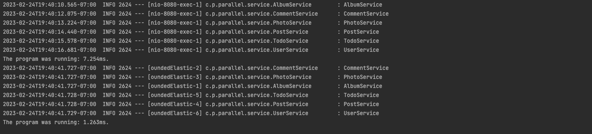

# Parallel Programming

The purpose of this app is to test the performance of a using Mono Object on different services.

````
localhost:8080/dummy - used without Mono Objects
````

``````
localhost:8080/dummyMono - used with Mono Objects
``````

Data was taken from [JsonPlaceHolder](https://jsonplaceholder.typicode.com)

Each data from the following endpoints are being place in Object called Dummy, and they have their own services

1. /posts	100 posts
2. /comments	500 comments
3. /albums	100 albums
4. /photos	5000 photos
5. /todos	200 todos
6. /users	10 users

Ex.
````java
public List<Albums> getAlbums(){
        TimeUnit.MILLISECONDS.sleep(1000);
        log.info("AlbumService");
        return dummyClient.getAlbums();
}
````

So even though it is calling the service I put delay it by one second for a minimum of 6 second total + extra

````java
public Mono<List<Albums>> getMonoAlbums()  {
        return Mono.fromCallable(() -> {
            TimeUnit.MILLISECONDS.sleep(1000);
            log.info("AlbumService");
            return dummyClient.getAlbums();
        }).subscribeOn(Schedulers.boundedElastic());
    }
````

In this example I'm creating a Mono Object which creates a new thread. So even though each service is one second 
they're running in parallel


Screenshot:


